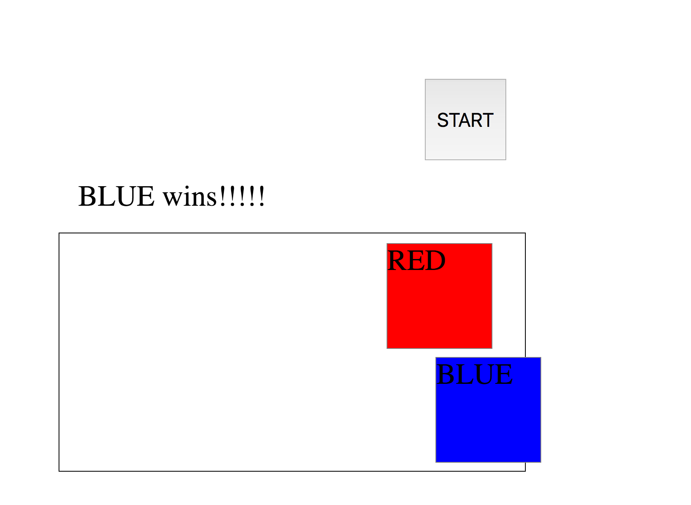

# JavaScript Racer

## Introduction

We are going to implement a "racer game" using JavaScript, HTML and CSS.  

## Exercise

#### Requirements

- The landing page should have a **"start"** button that triggers the function to begin the game.

- Your game should have two 'racers' that race across the screen. When the `right arrow` key or `z` is pressed, the racers should move correspondingly.
- Include separate HTML, CSS, JavaScript files
- Comment your code appropriately
- Adhere to the [AirBnB style guide](https://github.com/airbnb/javascript) for writing your JavaScript
- Adhere to the [Google style guide](https://google.github.io/styleguide/htmlcssguide.xml) for writing your HTML/CSS

**Bonus:**
- Use images to create a background and/or players
- Style your landing page using FlexBox
- Add animations
- Score each game based on the time it took to complete and by how much time they beat the opposing player

**Super Mega Bonus**
- Display the time it took for the player to complete the race
- Make a 'Best of 3' tournament and display the winner of the tournament
- Have players do something other than simply pressing a key to move their player, for example, make them type words, or solve simple math problems

#### Starter code

There is no starter code for this project other than blank HTML, JS, and CSS files. Here are some tips on how to get started, nut your process might be different:

- Start simple! Ask yourself what the minimal requirements are
- Create HTML and CSS files that create one red square div and one blue, lined up on the left side of the screen
- Add a keydown event listener that console logs "blue move" or "red move"
- replace that console log with JavaScript that moves the red or blue div a little to the right
- Run with it from there!
- If you are stuck on a problem, use pseudo-coding to break it down into smaller, more solvable problems

#### Deliverable

You should create a pull request on this repo (just like always)

Here's a screenshot of what your super basic bare minimum "Div Racer" page might look like:

## Additional Resources
- JavaScript [documentation](https://developer.mozilla.org/en-US/docs/Web/JavaScript)
- An [excellent resource](https://developer.mozilla.org/en-US/docs/Web/Events) for working with the DOM in vanilla JavaScript resource for students
